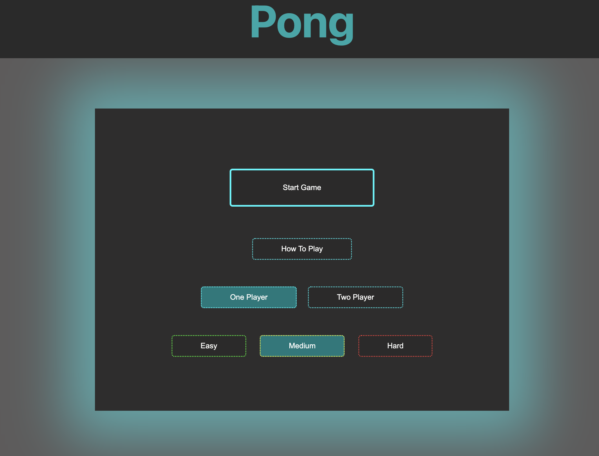

## Pong:
The game of Pong is a classic arcade video game that simulates table tennis. This is a vanilla JS implementation without using the canvas API.


#### Features:

* Single player mode 
* Two player mode
* Pause by pressing "p"

#### How To Play:

&nbsp;&nbsp;&nbsp;&nbsp;&nbsp;&nbsp;Visit: https://main--pong-shakes.netlify.app/

* Use W and S to move the left paddle up and down
* Use the arrow keys to move the right paddle up and down
* If the ball touches the left or right edge of the playing board,
a point is awarded to the opposite side.
* Ball will reset and game continues until score limit is reached



```
.
├── README.md
├── assets
│   ├── end-game-pic.png
│   ├── gameplay-screen.png
│   ├── main-menu.png
│   └── pong-start-screenshot.png
├── css
│   └── style.css
├── index.html
├── js
│   ├── Ball.js
│   ├── GameElement.js
│   ├── Options.js
│   ├── Paddle.js
│   ├── State.js
│   ├── app.js
│   ├── constants.js
│   ├── handlers.js
│   └── utils.js
└── soundsets
    ├── bounce1.mp3
    ├── bounce2.mp3
    ├── score-sound.mp3
    └── win-sound.mp3

```

